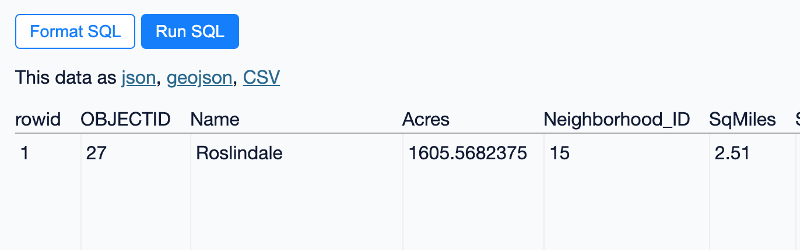

# datasette-geojson

[](https://pypi.org/project/datasette-geojson/)
[](https://github.com/eyeseast/datasette-geojson/releases)
[](https://github.com/eyeseast/datasette-geojson/actions?query=workflow%3ATest)
[](https://github.com/eyeseast/datasette-geojson/blob/main/LICENSE)

Add GeoJSON as an output option for datasette queries.

## Installation

Install this plugin in the same environment as Datasette.

    datasette install datasette-geojson

## Usage

To render GeoJSON, add a `.geojson` extension to any query URL that includes a `geometry` column. That column should be a valid [GeoJSON geometry](https://datatracker.ietf.org/doc/html/rfc7946#section-3.1).

For example, you might use [geojson-to-sqlite](https://pypi.org/project/geojson-to-sqlite/) or [shapefile-to-sqlite](https://pypi.org/project/shapefile-to-sqlite/) to load [neighborhood boundaries](https://bostonopendata-boston.opendata.arcgis.com/datasets/3525b0ee6e6b427f9aab5d0a1d0a1a28_0/explore) into a SQLite database.

```sh
wget -O neighborhoods.geojson https://opendata.arcgis.com/datasets/3525b0ee6e6b427f9aab5d0a1d0a1a28_0.geojson
geojson-to-sqlite boston.db neighborhoods neighborhoods.geojson --spatial-index # create a spatial index
datasette serve boston.db --load-extension spatialite
```

If you're using Spatialite, the geometry column will be in a binary format. If not, make sure the `geometry` column is a well-formed [GeoJSON geometry](https://datatracker.ietf.org/doc/html/rfc7946#section-3.1). If you used `geojson-to-sqlite` or `shapefile-to-sqlite`, you should be all set.

Run this query in Datasette and you'll see a link to download GeoJSON:

```sql
select
  rowid,
  OBJECTID,
  Name,
  Acres,
  Neighborhood_ID,
  SqMiles,
  ShapeSTArea,
  ShapeSTLength,
  geometry
from
  neighborhoods
order by
  rowid
limit
  101
```

Note that the geometry column needs to be explicitly _named_ `geometry` or you won't get the option to export GeoJSON. If you want to use a different column, rename it with `AS`: `SELECT other AS geometry FROM my_table`.



## Development

To set up this plugin locally, first checkout the code. Then create a new virtual environment:

    cd datasette-geojson
    python3 -mvenv venv
    source venv/bin/activate

Or if you are using `pipenv`:

    pipenv shell

Now install the dependencies and tests:

    pip install -e '.[test]'

To run the tests:

    pytest
